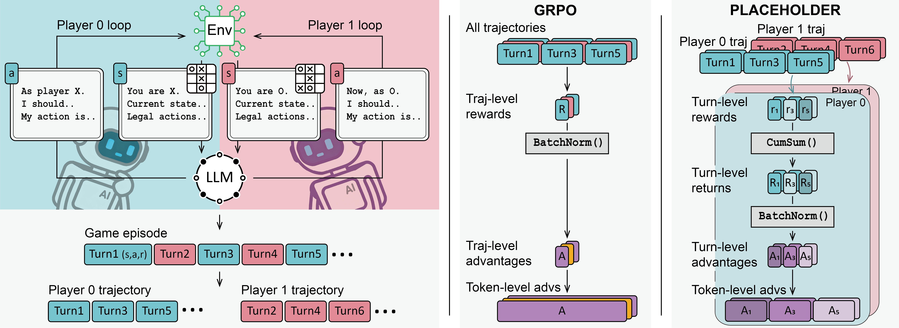
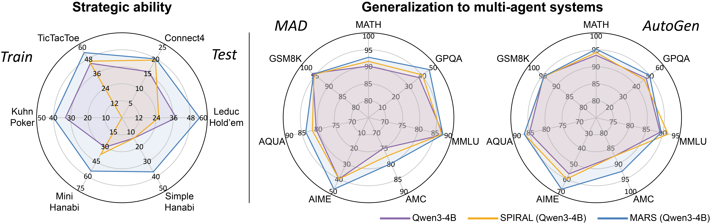

<div align="center">
  <h1>MARS: Reinforcing Multi-Agent Reasoning of LLMs through Self-Play in Strategic Games
  <br>
  <br>
  
  🤗 [Hugging Face Models](https://huggingface.co/MARS-LLM)
</div>

## Overview
<div align="center">
  
</div>

**Overview of MARS.** Left column: generating player trajectories through self-play in strategic games. Middle column: naive advantage estimation by GRPO. Right column: advantage estimation by MARS for accurate credit assignment in multi-turn, multi-agent setting.

<br>

<div align="center">
  
</div>

**Evaluation results** of our multi-game trained MARS model and two baseline models. MARS cultivates multi-agent skills from diverse games that generalize to multi-agent systems of MAD and AutoGen.


## Installation

The MARS project is built on the ROLL open-source framework.

Please follow the official ROLL installation guidance to ensure environment and backend compatibility: [ROLL Docs – Start](https://alibaba.github.io/ROLL/docs/English/start).


## Training


### Agentic RL Pipeline

```bash
# self-play
bash ROLL/examples/tictoctoe/run_agentic_pipeline_tictactoe_selfplay.sh

# rollout
bash ROLL/examples/tictoctoe/run_agentic_rollout_tictactoe.sh

# single agent
bash ROLL/examples/tictoctoe/run_agentic_pipeline_tictactoe_tune.sh
```

### TensorBoard

```bash
tensorboard --logdir=ROLL/runs/tictactoe_selfplay/
```

## Evaluation

Our evaluation follows the metrics and protocols described in the paper.


### 1) OOD Game Evaluation

We also evaluate out-of-distribution (OOD) game performance on Connect Four, Leduc Hold’em and Simple Hanabi. The game evaluation requires two steps:

1) Model Conversion

```bash
bash ROLL/model_convert.sh
```

2) Game Evaluation

```bash
bash ROLL/examples/model_game_eval/run_agentic_rollout_eval.sh
```


### 2) Benchmarks

- General Reasoning (Math): GSM8K, MATH, AQUA, AIME, AMC
- Science QA: GPQA
- Multi-Task QA: MMLU

## Acknowledgement

Our reinforcement learning training codebase is a fork of the [ROLL](https://github.com/alibaba/ROLL) framework. For rollouts, we used [vLLM](https://github.com/vllm-project/vllm). The base models are from [Qwen3-4B](https://github.com/QwenLM/Qwen3). Many thanks to the authors of these projects for their excellent contributions!


## Cite
```
@article{yuan2025mars,
  title={MARS: Reinforcing Multi-Agent Reasoning of LLMs through Self-Play in Strategic Games},
  author={Yuan, Huining and Xu, Zelai and Tan, Zheyue and Yi, Xiangmin and Guang, Mo and Long, Kaiwen and Hui, Haojia and Li, Boxun and Chen, Xinlei and Zhao, Bo and Zhang, Xiao-Ping and Yu, Chao and Wang, Yu},
  journal={coming soon},
  year={2025}
}
```
